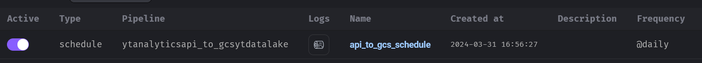

# Youtube Analytics

## Introduction
YouTube maintains a list of the top trending videos on the platform. According to Variety magazine, “To determine the year’s top-trending videos, YouTube uses a combination of factors including measuring users interactions (number of views, shares, comments and likes). Note that they’re not the most-viewed videos overall for the calendar year”.

## Context
The dataset for this project includes several months (and counting) of data on daily trending YouTube videos. Data is included for the IN, US, GB, DE, CA, FR, RU, BR, MX, KR, and JP regions (India, USA, Great Britain, Germany, Canada, France, Russia, Brazil, Mexico, South Korea, and, Japan respectively), with up to 200 listed trending videos per day. Each region’s data is in a separate file.

## Data Collation
The updated dataset can be found in [Kaggle](https://www.kaggle.com/datasets/rsrishav/youtube-trending-video-dataset), and the results may vary with what is presented in this project as the dataset is updated daily. Due to the nature of the Kaggle datastore, I sourced the data collectively and simulated an API link through github. This is stored in the release section of this repository and it entails the sourced data per region and a category lookup file as per the link below:

[Simulated Data Store](https://github.com/Josh-Murunga/Youtube-Analytics/releases)

## Technology Stack
This project utilizes the following technologies:

* **Github codespaces**: This is a simple to create on the go cloud VM for development purposes. 
* **Terraform**: Infrastructure as Code
* **Docker**: Containerization
* **Mage**: Workflow Orchestration and Batch
* **Google Cloud Storage (Bucket)**: Datalake
* **Google BigQuery**: Data Warehouse
* **DBT Cloud**: Transformation
* **Google Looker Studion**: Visualization

**NB**: This project assumes familiarity of these technologies and simmilar results may be produced by following the [commands file](commands.txt) stepwise. This also assumes knowledge of **GCP Service Accounts** and the necessary **Access Keys** to those accounts.

## Project Setup
Cloning this project to your preferred setup would suffice. For my instance, I deployed the project on a Github codespaces instance which is a free (to some extent) cloud VM setup by Github for projects.

### Setting up the infrastructure
Once the VM was up and running, I proceeded with the infrastructure setup for my project. This entailed setting up of:
* Data lake - Google Cloud Storage (Google Bucket)
* Data Warehouse - Google BigQuery
This is achievable through **Terraform**. Ensure terraform is installed in your instance, change into the terraform directory of the project and run the following commands. Ensure your service account keys are present in the keys directory:

```shell
# Initialize state file (.tfstate)
terraform init

# Check changes to new infra plan
terraform plan

# Create new infrastructure
terraform apply
```

With this, our infrastructure is ready for utilization for the project.

## Data Ingestion
The next step for this project is to ingest the data from our simulated data store and use it for our project. We Achieve this through worflow orchestration using **Mage**. Change into the mage directory and run the following commands. Ensure docker and docker-compose are installed in your instance:

```shell
# Pull the Mage Image
docker-compose -f docker-compose.yml up -d
```

This may overwrite the mage-zoomcamp directory available in this repository, however, this can easily be reporduced by logging in to the Mage UI and creating a new pipeline with the following useful files for the whole pipeline. As usual, ensure you have the access key accessible in the Mage container and is configured in the **io_config.yml**:

**For The API to GCS Pipeline**:
[Data Loader](mage/load_data_from_api.py): This will load data from our simulated data store
[Transformer](mage/transform_youtube_data.py): Perform some transformation in a data prerocessing step
[Data Exporter](mage/upload_to_analytics_datalake.py): Upload the transformed data into data lake as parquet files


**Batch**
Since this data is updated on a daily basis, we could set this pipeline to run on daily batches through a scheduler. This is made possible in Mage by creating a trigger.



## Data Warehouse
Having sourced our data into our data lake, we can proceed to sourcing the data into our data warehouse and performing the necessary partitioning and clustering of the data.

In the data warehouse directory of this project there is a series of queries in the[DWH.sql](data_warehouse/DWH.sql) file to be executed to achieve this. Rename the table structures in the file to follow your infrastructure.

We load our data from the data lake and partition the data by trending date and cluster them by category id. This in turn gives us a well partitioned and clustered dataset to work with for transformation and analytics.

## Transformation
Once our data is in the Data Warehouse, it is ready for transformation for analytics. For our case we make use of **DBT Cloud**. Again, this would require you to configure the DBT cloud instance to fit the service account with the access key. Change into the dbt-transformation-analytics directory from DBT cloud run:

```shell
# Build the project
dbt build
```
This would of course adhere to the settings under dbt_project.yml and the models directory for creating staging tables and fact tables in the data warehouse. For the channel category model, you can make use of the category lookup csv file found [Here](https://github.com/Josh-Murunga/Youtube-Analytics/releases), by placing it in the seeds directory.

## Dashboard
After transforming our data, we can now perform visual analytics where we would like to display our data in a format easy to understand. Our whole project revolved around YouTube trending videos and we indented to discover how they are distributed by category and the trends per month for whatever period available for our dataset. We can achieve this by creating two charts, a pie chart for the category distribution and a stacked bar graph for the time series distribution. We then add a date filter to freely select the range we would wish and the data will source directly from our data warehouse. The dashboard is accessible in the following link:

[YouTube Trending Videos Analytics](https://lookerstudio.google.com/reporting/22aef258-1349-488e-badd-21febd414b04)